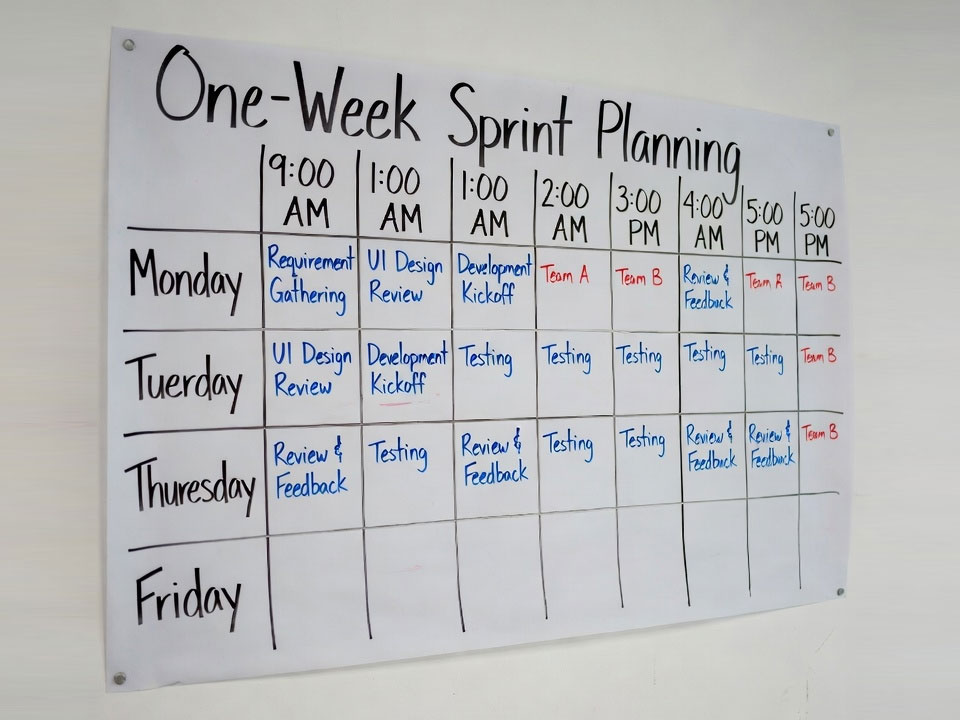

If you're a frontend developer, you know that feeling. The sprint is planned, the tasks are evaluated, but by the middle of the sprint everything goes awry. Suddenly, cross-browser issues surface, a "harmless" change breaks half of the components in the Storybook, and the backend API turns out to be not quite the same as described in the ticket.

Classic Scrum, tailored for versatility, often does not take into account the specifics of frontend development. Endless "rallies for the sake of rallies", strict deadlines for creative work and a constant context switch - all this kills both speed and quality.

It's time to change that. We've been experimenting for years and found a format that not only works, but *makes the team shine*. We present to you **A hybrid component-oriented sprint**.

#### Why does regular Scrum miss the target for the frontend?

1. **Unpredictability.** Frontend is not just about business logic. These are pixel-perfect, animations, accessibility, and performance. It is impossible to estimate the time for "making it nice and smooth" as accurately as for "implementing the endpoint".
2. **Context switch.** Switching between creating a new component, fixing bugs in the old code, and code review kills focus. Frontend is deep, visual work that requires concentration.
3. **Long-term quality vs. short-term goals.** In the pursuit of completing sprint tasks, technical debt is often clogged up: suboptimal bundles, compatibility crutches, and curved components. Sooner or later, this debt will paralyze development.

#### Pillars of our format: Three Pillars of Efficiency

Our format is based on three basic principles that transform chaos into order.

### 1. Component-First Planning

We are abandoning planning in terms of "pages" or "features" in its purest form. Instead, we break down the work into three distinct types of tasks.:

* **Creation/Component Refactoring (Component Work):** This is the basis. The task is to "Create a button" or "Refactor the virtualization table". These tasks are *inviolable*. They are evaluated with a margin for design review, testing in various states, and documentation in Storybook.
* **Integration tasks (Integration Work):** Assembling pages and features from ready-made components. This is working with status, routing, API requests.
* **Bugs and technical debt (Bugs & Debt):** We don't hide them in the backlog. In each sprint, a fixed percentage of time (for example, 20%) is reserved *immediately* for these purposes.

**How it looks in practice:** During planning, we first look at the design layouts and determine which *new* components we need. Their creation is our No. 1 priority in the sprint.

### 2. "Themed" Days

Instead of spreading different types of work across all the days of the sprint, we group them.

*   **Monday: Components Day.** Focused solely on creating and refactoring components. A minimum of meetings, a maximum of code in the stream.
* **Tuesday-Thursday: Integration Days.** We collect features, integrate with the backend, and write most of the business logic.
* **Friday: Day of Quality and Growth.** This is a day with no mandatory sprint tasks. We are engaged in:
    * **Code Review:** All pool requests accumulated during the week are reviewed and held.
    * **Refactoring:** We clean the code that "smells".
    * **By training:** Reports, workshops, and the study of new technologies.
    * **Experiments:** We are trying a new library or approach.

This approach radically reduces the context switch and allows you to immerse yourself in your work.

### 3. A one-week, not a two-week sprint

Yes, you heard right. The two-week cycle is too long for a dynamic frontend. A week-long sprint gives:
* **Quick feedback:** We often show the increment to the product manager and designers.
* **Flexibility:** Easier to adapt to changing requirements.
* **A sense of accomplishment:* Completing a sprint every Friday is psychologically very enjoyable and motivating.

#### What our sprint looks like from the inside (by day)

**Friday (Preparation):**
* **Short planning (30 min.):** The team with the product manager and designers briefly looks at the tasks for the next week. The designers have already prepared layouts and specifications for the new components.

**Monday (Components Day):**
* **Morning stand-up (15 min.):** "What will I do today in terms of components?".
* **Deep work:** Creating components, working in Storybook.
* **Evening synchronization (15 min.):** "What did you do, what problems did you encounter?"

**Tuesday-Thursday (Integration Days):**
* **Standard stand-ups.**
* **Basic development:** Building pages, working with the API, writing e2e tests.
* **Active code review.**

**Friday (Quality and Growth Day):**
* **No morning stand-up.**
* **Demo (30 min.):** An informal demonstration of what has been done in a week. We show not only features, but also cool reusable components.
* **Retrospective (30 min.):** What went well this week? What can be improved?
* **Free time:** for code review, refactoring, and training.

#### The results we got

By switching to this format, our team noticed drastic changes.:

* **The quality of the code has skyrocketed.** The components have become more thoughtful, versatile, and well-documented.
* **The development speed has increased.** A paradox? No. Fewer context switches and a higher-quality framework (components) accelerated integration in the long run.
* **Predictability.** Since the creation of components — the most unpredictable part — has been highlighted and protected, we have become much more accurate in estimating deadlines.
* **The happiness of developers.** The burnout from constant switching has disappeared. There was time for creativity and growth on Fridays.

#### Conclusion

There is no silver bullet, but the Hybrid component-based sprint is not just another methodology. This is a recognition that frontend is a special discipline that requires its own rhythm and its own approach.

Try to adapt this format to your team. Start by introducing "Theme Days" or allocating time for component work. You will quickly see how chaos gives way to flow, and your team begins to deliver not just code, but thoughtful, scalable, and beautiful products.

---